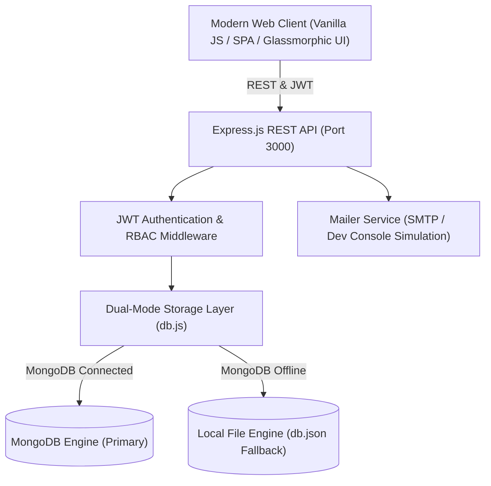

# IT Lease Hub

[](https://nodejs.org/)
[](https://expressjs.com/)
[](https://www.mongodb.com/)
[](LICENSE)
[](public/)

> **Enterprise-grade IT asset inventory, employee hardware loan tracking, and equipment leasing cost reconciliation system.**

IT Lease Hub centralizes hardware lifecycle management for IT and Accounting departments. It empowers modern organizations to track computer inventory across multiple office branches, handle inter-office logistics, log employee loans and return conditions, monitor leasing contracts, detect invoice discrepancies, and generate financial reports.

---

## Quick Start (TL;DR)

Get up and running in 30 seconds:

```bash
# 1. Clone repository
git clone https://github.com/your-username/it-lease-hub.git
cd it-lease-hub

# 2. Install dependencies
npm install

# 3. Seed demo data (7 devices, leases, loans, 3 role accounts)
npm run seed

# 4. Start the server
npm run dev
```

Open **`http://localhost:3000`** in your browser. Log in using `admin@firma.pl` / `admin123`.

---

## Architecture Overview



---

## Core Features

### 1. Role-Based Access Control (RBAC)
Tailored permissions and targeted views for three corporate roles:
- **IT Administrator**: Complete administrative control, hardware CRUD, audit log management, user role assignments.
- **IT Worker**: Manage device technical specifications, issue loans, process returns, initiate inter-office transfers. Financial lease values are read-only.
- **Accountant**: Manage lease contracts, actual vs. expected monthly installments, equipment values, and financial reconciliation. Technical specs and loan assignments are read-only.

### 2. Hardware Asset Management
- Comprehensive inventory tracking for laptops, workstations, and monitors.
- Dynamic filtering by device type, operational status, and dynamic office branch chips.
- Real-time instant search across brands, models, serial numbers, and asset tags.
- Detailed technical specifications (CPU, RAM, storage, condition notes).
- PDF inventory report generation with a single click.

### 3. Equipment Loans & Returns
- Issue hardware to employees with department tagging and return deadlines.
- Live tracking of active vs. overdue equipment loans.
- Return workflow with hardware condition assessment (`good` vs. `damaged`) and automated maintenance flagging.
- Complete audit trail and device history log.

### 4. Lease Management & Financial Reconciliation
- **Reconciliation Engine**: Compares contractually expected lease rates against actual billed invoice values to detect cost discrepancies and overbilling.
- **Contract Expiration Watchlist**: Automated notice board highlighting contracts expiring within the next 6 months.
- **Lease Calculator / TCO Simulator**: Dynamic financial simulation of monthly rates, interest costs, buyout values, and Total Cost of Ownership (TCO) with printable PDF simulation quotes.

### 5. Multi-Office Logistics & Dynamic Branch Management
- **Dynamic Branch Configuration**: Administrators can add, edit, and safely retire company offices directly via the UI (no hardcoded locations).
- **Headquarters Designation**: Designate which location acts as corporate HQ / central leasing hub.
- **Inter-Office Transfers**: Transfer hardware between any registered office branch with an intermediate state (`in_transit`), condition check upon receipt (`good` vs. `damaged`), and audit logging.
- **Cascading & Safety Guards**: Renaming an office automatically cascades across all stationed devices; deleting an office is strictly prevented if devices are assigned to it or if it is the sole remaining location.
- **Branch Leasing Cost Cards**: Leasing summary cards and analytics dynamically aggregate monthly expenses per office branch.

### 6. Zero-Config Database Fallback
- Runs seamlessly against a production or local **MongoDB** database.
- If MongoDB is unavailable or not installed, the application automatically switches to a built-in **local JSON database (`db.json`)** with zero manual configuration required.

### 7. Authentication & Security
- Secure session handling using JSON Web Tokens (JWT).
- Secure password hashing using bcrypt.
- Password recovery via time-limited 6-digit email OTP (One-Time Password) with console fallback in development mode.
- In-app password change for authenticated users.

---

## Tech Stack

| Layer | Technologies |
|---|---|
| **Backend** | Node.js, Express.js, JWT (`jsonwebtoken`), `bcryptjs`, `cors`, `dotenv` |
| **Database** | MongoDB via Mongoose, with automatic zero-config fallback to local file storage (`db.json`) |
| **Email Service** | Nodemailer with development fallback simulation (`last_sent_email.txt`) |
| **Frontend** | Vanilla JavaScript (ES6+), CSS3 (Modern Glassmorphic Dark UI), HTML5 |
| **Client Libraries**| Chart.js (Analytics), jsPDF (PDF export engine), FontAwesome Icons |

---

## Installation & Setup

### Prerequisites
- [Node.js](https://nodejs.org/) (v18.0.0 or higher recommended)
- *(Optional)* [MongoDB](https://www.mongodb.com/) (if not running, local JSON database mode activates automatically)

### Step-by-Step Setup

1. **Clone the repository:**
   ```bash
   git clone https://github.com/your-username/it-lease-hub.git
   cd it-lease-hub
   ```

2. **Install dependencies:**
   ```bash
   npm install
   ```

3. **Configure environment variables:**
   ```bash
   cp .env.example .env
   ```
   *(The default `.env` settings work out of the box for local development).*

4. **Database Seeding & Modes:**
   - **Populate with sample demo data** (recommended for evaluation):
     ```bash
     npm run seed
     ```
   - **Reset to a clean, empty state** (retains only the primary administrator account):
     ```bash
     npm run seed:clean
     ```

5. **Start the development server:**
   ```bash
   npm run dev
   # or for production:
   npm start
   ```

6. **Open in browser:**
   Navigate to **`http://localhost:3000`**.

---

## Default Accounts

When initialized with `npm run seed`, the following test accounts are ready to use:

| Role | Email | Password | Permissions |
|---|---|---|---|
| **IT Administrator** | `admin@firma.pl` | `admin123` | Full system & user administration |
| **IT Worker** | `it@firma.pl` | `it123456` | Equipment, loans, returns, and branch transfers |
| **Accountant** | `ksiegowosc@firma.pl` | `ksieg123` | Lease contracts, invoice amounts, and financial reconciliation |

> When running on a clean database (`npm run seed:clean`), the system ensures the primary **IT Administrator** (`admin@firma.pl` / `admin123`) is ready for first login so you can add devices and users from scratch.

---

## Database Management Commands

| Command | Description |
|---|---|
| `npm run seed` | Resets and seeds the database with realistic demo devices, loans, activities, and 3 role accounts. |
| `npm run seed:clean` | Empties all devices, loans, and activities, leaving only the clean administrator account. |

---

## Configuration (`.env`)

| Variable | Default | Description |
|---|---|---|
| `PORT` | `3000` | HTTP port for the web server |
| `MONGO_URI` | `mongodb://localhost:27017/it-lease` | MongoDB connection string |
| `JWT_SECRET` | `it-lease-hub-super-secret-key-2026` | Secret key used to sign session tokens |
| `SMTP_HOST` | *(Optional)* | SMTP host for sending real password reset emails |
| `SMTP_PORT` | `587` | SMTP server port |
| `SMTP_SECURE` | `false` | Enable TLS encryption (`true` for port 465) |
| `SMTP_USER` | *(Optional)* | SMTP username |
| `SMTP_PASS` | *(Optional)* | SMTP password |
| `SMTP_FROM` | `no-reply@firma.pl` | From address for transactional emails |

> **Development Mode**: If SMTP credentials are left empty, password recovery OTP codes are printed directly to the server terminal and logged to `last_sent_email.txt`.

---

## REST API Reference

### Authentication
- `POST /api/auth/register` — Register a new account
- `POST /api/auth/login` — Authenticate and receive a JWT token
- `GET /api/auth/me` — Retrieve current authenticated session profile
- `POST /api/auth/change-password` — Change password for current user
- `POST /api/auth/forgot-password/request` — Request 6-digit recovery OTP
- `POST /api/auth/forgot-password/reset` — Verify OTP code and set new password

### Devices & Inventory
- `GET /api/devices` — List devices with filters (`type`, `status`, `location`, `search`)
- `GET /api/devices/:id` — Retrieve single device details
- `POST /api/devices` — Create a new device *(IT / Admin)*
- `PUT /api/devices/:id` — Update device specs or financial details *(Role-filtered)*
- `DELETE /api/devices/:id` — Remove device from inventory *(Admin only)*
- `POST /api/devices/:id/transfer` — Initiate inter-office transfer *(IT / Admin)*
- `POST /api/devices/:id/confirm-transfer` — Confirm delivery & inspect condition *(IT / Admin)*

### Office & Branch Management
- `GET /api/offices` — List all registered company office locations & HQ designation
- `POST /api/offices` — Add a new office branch *(Admin only)*
- `PUT /api/offices/:id` — Update branch details & automatically cascade renames to all devices *(Admin only)*
- `DELETE /api/offices/:id` — Safely remove an office *(Admin only, verifies 0 devices assigned & >=1 office remains)*

### Loans & History
- `POST /api/devices/:id/loan` — Issue hardware loan to employee *(IT / Admin)*
- `POST /api/devices/:id/return` — Process equipment return *(IT / Admin)*
- `GET /api/loans/active` — List active equipment loans
- `GET /api/history` — List complete loan history
- `DELETE /api/history/:id` — Delete a single loan history record *(Admin only)*
- `DELETE /api/history/completed` — Bulk delete returned loan records *(Admin only)*

### Analytics & System
- `GET /api/stats` — Summary metrics and device distribution counters (dynamically grouped by branch)
- `GET /api/activities` — Centralized audit activity feed
- `DELETE /api/activities` — Clear system activity history *(Admin only)*

---

## Project Structure

```text
├── models/
│   ├── Activity.js       # Audit log Mongoose schema
│   ├── Device.js         # Hardware asset & leasing Mongoose schema
│   ├── Loan.js           # Equipment loan record schema
│   ├── Office.js         # Company office & HQ designation schema
│   └── User.js           # User account & credential schema
├── public/
│   ├── app.js            # Frontend application logic & API client
│   ├── index.html        # Single-page interface markup & modals
│   └── styles.css        # Responsive dark glassmorphism design system
├── .env.example          # Template environment configuration
├── .gitignore            # Git exclusion definitions
├── db.js                 # Unified database layer (MongoDB & JSON fallback)
├── mailer.js             # Email transport & local development simulator
├── package.json          # Project metadata, scripts, and dependencies
├── README.md             # Project documentation
├── seed.js               # Database seeding and cleanup CLI utility
└── server.js             # Express application & API routing
```

---

## License

This project is licensed under the [MIT License](LICENSE).
